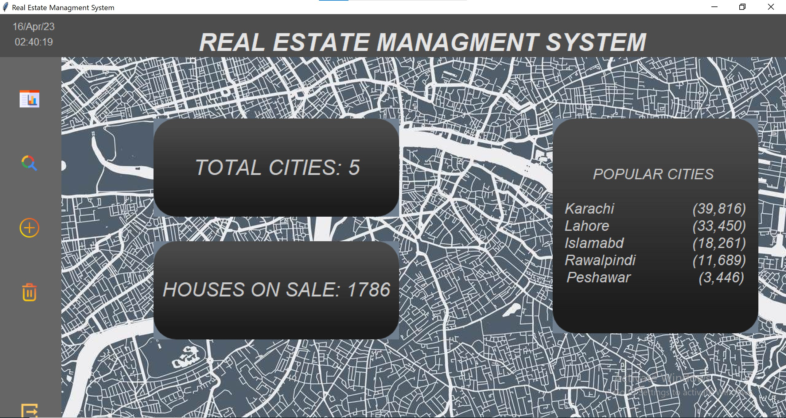
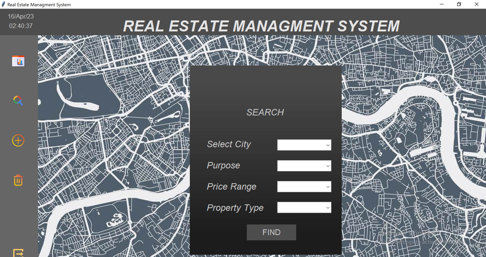
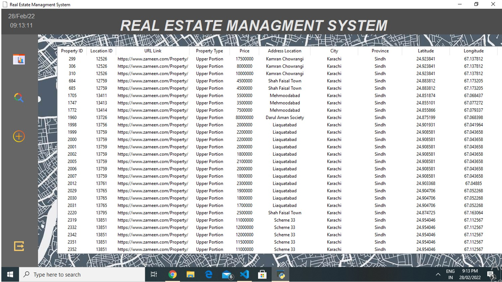
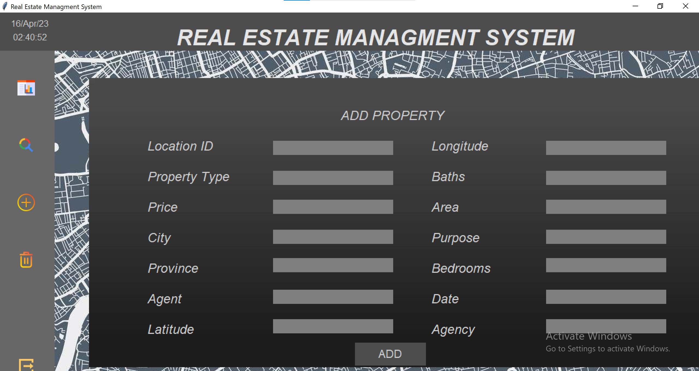
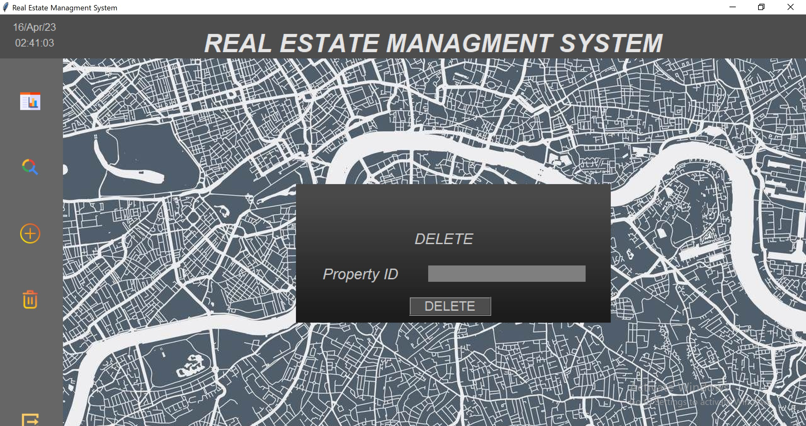

# Real-Estate-Management-System-using-pyhton

REAL  ESTATE MANAGEMENT SYSTEM:
 
The system is designed by using tkinter at frontend and access database at backend by using python.Database was manipulated using pyodbc module and SQL queries.

<h2>Dashboard:<h2/>
 
 

 <h2>Search:<h2/>
 
 

  <h2>Display:<h2/>
 
 

 <h2>Add:<h2/>
 
 

<h2>Delete:<h2/>
 
 

